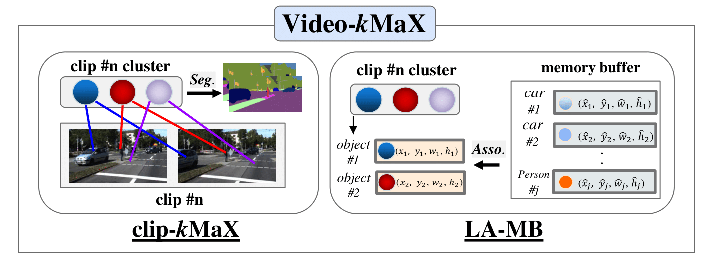

# Video-kMaX (WACV 2024)

This is an official implementation of our WACV 2024 paper: [Video-kMaX](https://arxiv.org/pdf/2304.04694.pdf)

We propose a unified approach for online and near-online VPS. The meta architecture of the proposed Video-kMaX consists of two components: within clip segmenter (for clip-level segmentation) and cross-clip associater (for association beyond clips). We propose clip-kMaX (clip k-means mask transformer) and HiLA-MB (Hierarchical Location-Aware Memory Buffer) to instantiate the segmenter and associater, respectively. Our general formulation includes the online scenario as a special case by adopting clip length of one.

<p align="center">
   
</p>

## Installation
The code-base is verified with pytorch==1.12.1, torchvision==0.13.1, cudatoolkit==11.3, and detectron2==0.6,
please install other libiaries through *pip3 install -r requirements.txt*

Please refer to [Mask2Former's script](https://github.com/facebookresearch/Mask2Former/blob/main/datasets/README.md) for data preparation.


## Model Zoo


### VIPSeg VPS

#### Near-online (pretrained model: [COCO pseudo video](https://drive.google.com/drive/folders/1CX4V1wYlAPW0vqkMP9tSDlqvjjVy4vWS?usp=sharing))

<table><tbody>
<!-- START TABLE -->
<!-- TABLE HEADER -->
<th valign="bottom">Backbone</th>
<th valign="bottom">SQ</th>
<th valign="bottom">AQ</th>
<th valign="bottom">STQ</th>
<th valign="bottom">VPQ</th>
<th valign="bottom">ckpt</th>
<!-- TABLE BODY -->
 <!-- <tr><td align="left"><a href="./configs/coco/panoptic_segmentation/kmax_r50.yaml">ResNet-50</td> -->
 <tr><td align="left">ResNet-50</td>
<td align="center"> 45.1 </td>
<td align="center"> 35.3 </td>
<td align="center"> 39.9 </td>
<td align="center"> 38.2 </td>
<td align="center"><a href="https://drive.google.com/drive/folders/1gCbGXrk8LxbX73ZXpFn3DpVbICD3BndA?usp=sharing">download</a></td>
</tr>
<!-- <tr align="center"> ConvNeXt-Large </td> -->
 <tr><td align="left">ConvNeXt-Large</td>
<td align="center"> 61.4 </td>
<td align="center"> 43.5 </td>
<td align="center"> 51.7 </td>
<td align="center"> 51.9 </td>
<td align="center"><a href="https://drive.google.com/drive/folders/1yxa7kouUGfoxhyG95tdYbe_s--58TaGF?usp=sharing">download</a></td>
</tr>
</tbody></table>

#### Online (pretrained model: [COCO](https://drive.google.com/drive/folders/1y_F8gJfZ2u9oDhqJy2y61FfpOBFGDWk7?usp=sharing))

<table><tbody>
<!-- START TABLE -->
<!-- TABLE HEADER -->
<th valign="bottom">Backbone</th>
<th valign="bottom">SQ</th>
<th valign="bottom">AQ</th>
<th valign="bottom">STQ</th>
<th valign="bottom">VPQ</th>
<th valign="bottom">ckpt</th>
<!-- TABLE BODY -->
 <tr><td align="left">ResNet-50</td>
<!-- <tr align="center"> ResNet-50 </td> -->
<td align="center"> 46.3 </td>
<td align="center"> 32.4 </td>
<td align="center"> 38.7 </td>
<td align="center"> 36.8 </td>
<td align="center"><a href="https://drive.google.com/drive/folders/1gCbGXrk8LxbX73ZXpFn3DpVbICD3BndA?usp=sharing">download</a></td>
</tr>
 <tr><td align="left">ConvNeXt-Large</td>
<!-- <tr align="center"> ConvNeXt-Large </td> -->
<td align="center"> 60.7 </td>
<td align="center"> 40.2 </td>
<td align="center"> 49.4 </td>
<td align="center"> 49.4 </td>
<td align="center"><a href="https://drive.google.com/drive/folders/1yxa7kouUGfoxhyG95tdYbe_s--58TaGF?usp=sharing">download</a></td>
</tr>
</tbody></table>

### KITTI-STEP VPS

#### Near-online (pretrained model: [Cityscape](https://drive.google.com/drive/folders/1u-VBjkrPRP2NiFOVF15Lmd01ZDALVwsx?usp=sharing))

<table><tbody>
<!-- START TABLE -->
<!-- TABLE HEADER -->
<th valign="bottom">Backbone</th>
<th valign="bottom">SQ</th>
<th valign="bottom">AQ</th>
<th valign="bottom">STQ</th>
<th valign="bottom">ckpt</th>
<!-- TABLE BODY -->
 <!-- <tr><td align="left"><a href="./configs/coco/panoptic_segmentation/kmax_r50.yaml">ResNet-50</td> -->
 <tr><td align="left">ResNet-50</td>
<td align="center"> 74.2 </td>
<td align="center"> 74.2 </td>
<td align="center"> 74.2 </td>
<td align="center"><a href="">download</a></td>
</tr>
<!-- <tr align="center"> ConvNeXt-Large </td> -->
 <tr><td align="left">ConvNeXt-Large</td>
<td align="center"> 79.0 </td>
<td align="center"> 78.8 </td>
<td align="center"> 78.9 </td>
<td align="center"><a href="">download</a></td>
</tr>
</tbody></table>

#### Online (pretrained model: [Cityscape pseudo video](https://drive.google.com/drive/folders/1y_F8gJfZ2u9oDhqJy2y61FfpOBFGDWk7?usp=sharing))

<table><tbody>
<!-- START TABLE -->
<!-- TABLE HEADER -->
<th valign="bottom">Backbone</th>
<th valign="bottom">SQ</th>
<th valign="bottom">AQ</th>
<th valign="bottom">STQ</th>
<th valign="bottom">ckpt</th>
<!-- TABLE BODY -->
 <!-- <tr><td align="left"><a href="./configs/coco/panoptic_segmentation/kmax_r50.yaml">ResNet-50</td> -->
<!-- <tr align="center"> ResNet-50 </td> -->
 <tr><td align="left">ResNet-50</td>
<td align="center"> 75.0 </td>
<td align="center"> 72.0 </td>
<td align="center"> 73.5 </td>
<td align="center"><a href="">download</a></td>
</tr>
 <tr><td align="left">ConvNeXt-Large</td>
<td align="center"> 77.2 </td>
<td align="center"> 75.7 </td>
<td align="center"> 76.5 </td>
<td align="center"><a href="">download</a></td>
</tr>
</tbody></table>

## Citing Video-kMaX

If you find this code helpful in your research or wish to refer to the baseline
results, please use the following BibTeX entry.

(current BibTeX is for arxiv. We will replace it with WACV version after proceeding)

```
@misc{shin2023videokmax,
      title={Video-kMaX: A Simple Unified Approach for Online and Near-Online Video Panoptic Segmentation}, 
      author={Inkyu Shin and Dahun Kim and Qihang Yu and Jun Xie and Hong-Seok Kim and Bradley Green and In So Kweon and Kuk-Jin Yoon and Liang-Chieh Chen},
      year={2023},
      eprint={2304.04694},
      archivePrefix={arXiv},
      primaryClass={cs.CV}
}
```